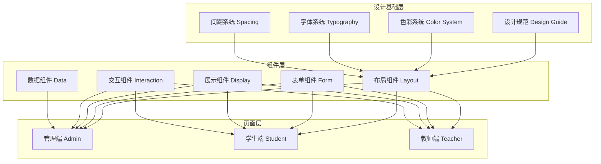

# 考试系统原型设计 - 设计文档

## 概述

本设计文档定义了考试系统原型的完整设计规范、组件库架构和页面实现方案。原型采用**静态 HTML + TailwindCSS + FontAwesome**技术栈，实现高保真、可交互的原型系统，覆盖管理端（4个子模块24页）、学生端（8页）、教师端（6页），共计38个页面。

### 设计目标
1. **统一性**：建立完整的设计规范体系，确保所有页面视觉和交互一致
2. **可复用性**：构建模块化组件库，提高开发效率
3. **可维护性**：清晰的文件组织和命名规范，便于后续迭代
4. **可实施性**：设计方案可直接指导前端开发团队实施

### 设计风格
- **主题色**：教育绿（#00B96B）- 清新、活力、亲和的教育氛围
- **设计风格**：现代扁平化设计，简洁明快
- **用户体验**：降低学习成本，提升操作效率

---

## 架构设计

### 整体架构



### 模块化设计原则

**单一职责原则**：
- 每个 HTML 文件专注于一个页面功能
- 每个组件文件专注于一个组件实现
- 文件大小控制在 300 行以内

**组件复用原则**：
- 公共组件提取到 `shared/components/` 目录
- 使用 HTML `<template>` 标签定义可复用组件
- 通过 JavaScript 实现组件动态插入

**层次分离原则**：
- 设计规范层：定义设计 Token
- 组件层：实现可复用组件
- 页面层：组装组件完成业务页面

---

## 设计规范体系

### 1. 色彩系统

#### 主色调（Primary - 教育绿）
```css
--primary-50: #E6F9F0;      /* 极浅绿 - 背景 */
--primary-100: #B3EDCE;     /* 浅绿 - 悬停背景 */
--primary-200: #80E0AD;     /* 中浅绿 */
--primary-300: #4DD48B;     /* 中绿 */
--primary-400: #1AC76A;     /* 中深绿 */
--primary-500: #00B96B;     /* 主色 - 按钮、链接（教育绿） */
--primary-600: #00A35C;     /* 深绿 - 按钮悬停 */
--primary-700: #008A4D;     /* 更深绿 */
--primary-800: #00703E;     /* 极深绿 */
--primary-900: #00572F;     /* 最深绿 */
```

**TailwindCSS 使用：**
- 主按钮：`bg-primary-500 hover:bg-primary-600`
- 链接：`text-primary-500 hover:text-primary-600`
- 背景高亮：`bg-primary-50`

#### 语义色（Semantic）
```css
--success-50: #E8FFEA;      /* 成功背景 */
--success-500: #00B42A;     /* 成功主色 */
--success-600: #009A24;     /* 成功深色 */

--warning-50: #FFF7E8;      /* 警告背景 */
--warning-500: #FF7D00;     /* 警告主色 */
--warning-600: #D66A00;     /* 警告深色 */

--error-50: #FFECE8;        /* 错误背景 */
--error-500: #F53F3F;       /* 错误主色 */
--error-600: #CB2634;       /* 错误深色 */

--info-50: #E8F7FF;         /* 信息背景 */
--info-500: #14C9C9;        /* 信息主色 */
--info-600: #0EAAAA;        /* 信息深色 */
```

#### 中性色（Neutral）
```css
--gray-50: #F7F8FA;         /* 页面背景 */
--gray-100: #F2F3F5;        /* 卡片背景 */
--gray-200: #E5E6EB;        /* 边框 */
--gray-300: #C9CDD4;        /* 分割线 */
--gray-400: #A9AEB8;        /* 禁用文字 */
--gray-500: #86909C;        /* 次要文字 */
--gray-600: #6B7785;        /* 辅助文字 */
--gray-700: #4E5969;        /* 正文 */
--gray-800: #272E3B;        /* 标题 */
--gray-900: #1D2129;        /* 主标题 */
```

---

### 2. 字体系统

#### 字体族
```css
font-family: 'PingFang SC', 'Microsoft YaHei', -apple-system, BlinkMacSystemFont,
             'Segoe UI', Roboto, 'Helvetica Neue', Arial, sans-serif;
```

#### 字号规范
| 用途 | 字号 | 行高 | TailwindCSS |
|------|------|------|-------------|
| 大标题 | 24px | 32px | `text-2xl leading-8` |
| 页面标题 | 20px | 28px | `text-xl leading-7` |
| 区块标题 | 16px | 24px | `text-base leading-6` |
| 正文 | 14px | 22px | `text-sm leading-[22px]` |
| 辅助文字 | 13px | 20px | `text-[13px] leading-5` |
| 说明文字 | 12px | 18px | `text-xs leading-[18px]` |

#### 字重规范
| 用途 | 字重 | TailwindCSS |
|------|------|-------------|
| 标题 | 600 (SemiBold) | `font-semibold` |
| 强调 | 500 (Medium) | `font-medium` |
| 正文 | 400 (Regular) | `font-normal` |
| 次要 | 400 (Regular) | `font-normal` |

---

### 3. 间距系统

**8px 倍数原则**：
```
4px  = 0.5   (极小间距)
8px  = 2     (小间距)
12px = 3     (常规间距)
16px = 4     (标准间距)
20px = 5     (中等间距)
24px = 6     (大间距)
32px = 8     (较大间距)
40px = 10    (很大间距)
48px = 12    (超大间距)
```

**使用示例**：
- 卡片内边距：`p-6` (24px)
- 按钮内边距：`px-4 py-2` (16px/8px)
- 元素间距：`space-y-4` (16px)
- 栅格列间距：`gap-4` (16px)

---

### 4. 圆角与阴影

#### 圆角规范
```css
--radius-small: 2px;     /* 小圆角 - 标签 */
--radius-medium: 4px;    /* 中圆角 - 按钮、输入框 */
--radius-large: 8px;     /* 大圆角 - 卡片 */
--radius-full: 9999px;   /* 全圆角 - 徽章 */
```

**TailwindCSS 使用**：
- 按钮：`rounded` (4px)
- 卡片：`rounded-lg` (8px)
- 徽章：`rounded-full`

#### 阴影规范
```css
/* 悬浮阴影 */
--shadow-small: 0 2px 8px rgba(0, 0, 0, 0.08);
--shadow-medium: 0 4px 16px rgba(0, 0, 0, 0.12);
--shadow-large: 0 8px 32px rgba(0, 0, 0, 0.16);
```

**TailwindCSS 使用**：
- 卡片：`shadow-sm`
- 下拉菜单：`shadow-md`
- 模态框：`shadow-lg`

---

## 组件库设计

### 5. 布局组件

#### 5.1 页面布局框架（AdminLayout）

**结构**：
```html
<div class="min-h-screen bg-gray-50">
  <!-- 顶部导航栏 -->
  <header class="h-16 bg-white border-b border-gray-200 fixed top-0 left-0 right-0 z-50">
    <div class="flex items-center justify-between h-full px-6">
      <div class="flex items-center space-x-4">
        <!-- Logo -->
        <div class="text-xl font-semibold text-gray-900">考试系统</div>
        <!-- 面包屑 -->
        <nav class="breadcrumb"></nav>
      </div>
      <div class="flex items-center space-x-4">
        <!-- 通知 -->
        <button class="icon-btn"><i class="fas fa-bell"></i></button>
        <!-- 用户菜单 -->
        <div class="user-menu"></div>
      </div>
    </div>
  </header>

  <!-- 侧边栏 -->
  <aside class="w-64 bg-white border-r border-gray-200 fixed top-16 left-0 bottom-0 overflow-y-auto">
    <nav class="sidebar-nav p-4">
      <!-- 导航菜单 -->
    </nav>
  </aside>

  <!-- 主内容区 -->
  <main class="ml-64 pt-16 min-h-screen">
    <div class="p-6">
      <!-- 页面内容 -->
    </div>
  </main>
</div>
```

**状态**：
- 侧边栏可折叠（通过 JavaScript 控制 `ml-64` 变为 `ml-20`）
- 顶栏固定在顶部
- 内容区自适应高度

#### 5.2 面包屑导航（Breadcrumb）

**结构**：
```html
<nav class="flex items-center space-x-2 text-sm text-gray-600">
  <a href="#" class="hover:text-primary-500">首页</a>
  <i class="fas fa-chevron-right text-xs text-gray-400"></i>
  <a href="#" class="hover:text-primary-500">题库管理</a>
  <i class="fas fa-chevron-right text-xs text-gray-400"></i>
  <span class="text-gray-900 font-medium">题目列表</span>
</nav>
```

#### 5.3 页面标题栏（PageHeader）

**结构**：
```html
<div class="flex items-center justify-between mb-6">
  <div>
    <h1 class="text-2xl font-semibold text-gray-900">题目列表</h1>
    <p class="mt-1 text-sm text-gray-500">管理和查看所有题目信息</p>
  </div>
  <div class="flex items-center space-x-3">
    <!-- 操作按钮 -->
    <button class="btn-secondary">导出</button>
    <button class="btn-primary">新增题目</button>
  </div>
</div>
```

---

### 6. 表单组件

#### 6.1 输入框（Input）

**文本输入**：
```html
<div class="form-group">
  <label class="form-label">题目名称</label>
  <input type="text"
         class="form-input"
         placeholder="请输入题目名称">
  <p class="form-help">最多50个字符</p>
</div>
```

**CSS 类定义**：
```css
.form-group { @apply mb-4; }
.form-label { @apply block text-sm font-medium text-gray-700 mb-2; }
.form-input {
  @apply w-full px-3 py-2 border border-gray-300 rounded
         focus:outline-none focus:ring-2 focus:ring-primary-500 focus:border-primary-500
         disabled:bg-gray-100 disabled:cursor-not-allowed;
}
.form-help { @apply mt-1 text-xs text-gray-500; }
.form-error { @apply mt-1 text-xs text-error-500; }
```

**状态**：
- 默认：`border-gray-300`
- 聚焦：`ring-2 ring-primary-500 border-primary-500`
- 错误：`border-error-500 ring-error-500`
- 禁用：`bg-gray-100 cursor-not-allowed`

#### 6.2 下拉选择（Select）

**单选下拉**：
```html
<div class="form-group">
  <label class="form-label">题型</label>
  <select class="form-select">
    <option value="">请选择题型</option>
    <option value="single">单选题</option>
    <option value="multiple">多选题</option>
    <option value="judge">判断题</option>
  </select>
</div>
```

**可搜索下拉**（使用 JavaScript 增强）：
```html
<div class="form-group">
  <label class="form-label">知识点</label>
  <div class="relative">
    <input type="text"
           class="form-input"
           placeholder="搜索知识点">
    <div class="dropdown-menu absolute w-full mt-1 bg-white border border-gray-200 rounded-lg shadow-md hidden">
      <ul class="max-h-60 overflow-y-auto">
        <li class="dropdown-item">知识点1</li>
        <li class="dropdown-item">知识点2</li>
      </ul>
    </div>
  </div>
</div>
```

#### 6.3 单选框与多选框

**单选框组**：
```html
<div class="form-group">
  <label class="form-label">难度</label>
  <div class="flex items-center space-x-6">
    <label class="inline-flex items-center">
      <input type="radio" name="difficulty" value="1" class="form-radio">
      <span class="ml-2 text-sm text-gray-700">一级</span>
    </label>
    <label class="inline-flex items-center">
      <input type="radio" name="difficulty" value="2" class="form-radio">
      <span class="ml-2 text-sm text-gray-700">二级</span>
    </label>
  </div>
</div>
```

**多选框**：
```html
<label class="inline-flex items-center">
  <input type="checkbox" class="form-checkbox">
  <span class="ml-2 text-sm text-gray-700">记住密码</span>
</label>
```

**CSS 类**：
```css
.form-radio { @apply text-primary-500 focus:ring-primary-500; }
.form-checkbox { @apply text-primary-500 rounded focus:ring-primary-500; }
```

#### 6.4 开关（Switch）

```html
<label class="inline-flex items-center cursor-pointer">
  <input type="checkbox" class="sr-only peer">
  <div class="relative w-11 h-6 bg-gray-300 rounded-full peer
              peer-checked:bg-primary-500
              after:content-[''] after:absolute after:top-0.5 after:left-0.5
              after:bg-white after:rounded-full after:h-5 after:w-5
              after:transition-all peer-checked:after:translate-x-5">
  </div>
  <span class="ml-3 text-sm text-gray-700">启用</span>
</label>
```

#### 6.5 日期时间选择器

```html
<div class="form-group">
  <label class="form-label">开始时间</label>
  <input type="datetime-local" class="form-input">
</div>
```

#### 6.6 富文本编辑器（简化版）

```html
<div class="form-group">
  <label class="form-label">题干</label>
  <div class="rich-editor">
    <!-- 工具栏 -->
    <div class="editor-toolbar bg-gray-50 border-b border-gray-200 p-2 flex items-center space-x-2">
      <button class="toolbar-btn" title="加粗"><i class="fas fa-bold"></i></button>
      <button class="toolbar-btn" title="斜体"><i class="fas fa-italic"></i></button>
      <button class="toolbar-btn" title="下划线"><i class="fas fa-underline"></i></button>
      <div class="w-px h-5 bg-gray-300 mx-1"></div>
      <button class="toolbar-btn" title="插入图片"><i class="fas fa-image"></i></button>
      <button class="toolbar-btn" title="插入公式"><i class="fas fa-function"></i></button>
    </div>
    <!-- 编辑区 -->
    <div class="editor-content min-h-[200px] p-4 border border-gray-300 rounded-b focus-within:ring-2 focus-within:ring-primary-500"
         contenteditable="true">
    </div>
  </div>
</div>
```

#### 6.7 文件上传

```html
<div class="form-group">
  <label class="form-label">上传文档</label>
  <div class="upload-area border-2 border-dashed border-gray-300 rounded-lg p-8 text-center
              hover:border-primary-500 cursor-pointer">
    <i class="fas fa-cloud-upload-alt text-4xl text-gray-400 mb-4"></i>
    <p class="text-sm text-gray-600">点击或拖拽文件到此处上传</p>
    <p class="text-xs text-gray-400 mt-2">支持 PDF、Word 格式，最大 50MB</p>
    <input type="file" class="hidden" accept=".pdf,.doc,.docx">
  </div>
  <!-- 已上传文件列表 -->
  <div class="mt-3 space-y-2">
    <div class="flex items-center justify-between p-3 bg-gray-50 rounded">
      <div class="flex items-center space-x-3">
        <i class="fas fa-file-pdf text-error-500"></i>
        <span class="text-sm text-gray-700">试卷文档.pdf</span>
        <span class="text-xs text-gray-400">2.5 MB</span>
      </div>
      <button class="text-gray-400 hover:text-error-500">
        <i class="fas fa-times"></i>
      </button>
    </div>
  </div>
</div>
```

---

### 7. 展示组件

#### 7.1 表格（Table）

**标准表格**：
```html
<div class="table-container">
  <table class="data-table">
    <thead>
      <tr>
        <th><input type="checkbox" class="form-checkbox"></th>
        <th>题目ID</th>
        <th>题干</th>
        <th>题型</th>
        <th>知识点</th>
        <th>难度</th>
        <th>创建时间</th>
        <th>操作</th>
      </tr>
    </thead>
    <tbody>
      <tr>
        <td><input type="checkbox" class="form-checkbox"></td>
        <td><span class="text-primary-500 font-mono">Q001</span></td>
        <td class="max-w-md truncate">这是一道题目的题干内容...</td>
        <td><span class="badge badge-info">单选题</span></td>
        <td>数学基础</td>
        <td><span class="badge badge-warning">二级</span></td>
        <td class="text-gray-500 text-sm">2026-01-15</td>
        <td>
          <div class="flex items-center space-x-2">
            <button class="text-primary-500 hover:text-primary-600" title="查看">
              <i class="fas fa-eye"></i>
            </button>
            <button class="text-gray-500 hover:text-gray-700" title="编辑">
              <i class="fas fa-edit"></i>
            </button>
            <button class="text-error-500 hover:text-error-600" title="删除">
              <i class="fas fa-trash"></i>
            </button>
          </div>
        </td>
      </tr>
    </tbody>
  </table>
</div>
```

**CSS 类**：
```css
.table-container { @apply overflow-x-auto bg-white rounded-lg border border-gray-200; }
.data-table { @apply w-full; }
.data-table thead { @apply bg-gray-50; }
.data-table th {
  @apply px-6 py-3 text-left text-xs font-medium text-gray-500 uppercase tracking-wider;
}
.data-table tbody tr { @apply border-t border-gray-200 hover:bg-gray-50; }
.data-table td { @apply px-6 py-4 whitespace-nowrap text-sm text-gray-700; }
```

#### 7.2 卡片（Card）

**基础卡片**：
```html
<div class="card">
  <div class="card-header">
    <h3 class="card-title">卡片标题</h3>
  </div>
  <div class="card-body">
    <p class="text-sm text-gray-600">卡片内容</p>
  </div>
</div>
```

**统计卡片**：
```html
<div class="stat-card">
  <div class="flex items-center justify-between">
    <div>
      <p class="text-sm text-gray-500">总题目数</p>
      <p class="text-3xl font-semibold text-gray-900 mt-2">1,234</p>
      <p class="text-sm text-success-500 mt-1">
        <i class="fas fa-arrow-up"></i> 12% 较上周
      </p>
    </div>
    <div class="w-16 h-16 bg-primary-50 rounded-full flex items-center justify-center">
      <i class="fas fa-book text-2xl text-primary-500"></i>
    </div>
  </div>
</div>
```

**CSS 类**：
```css
.card { @apply bg-white rounded-lg shadow-sm border border-gray-200; }
.card-header { @apply px-6 py-4 border-b border-gray-200; }
.card-title { @apply text-base font-semibold text-gray-900; }
.card-body { @apply px-6 py-4; }
.stat-card { @apply bg-white rounded-lg shadow-sm border border-gray-200 p-6 hover:shadow-md transition; }
```

#### 7.3 标签（Tag）

```html
<span class="tag tag-primary">P0</span>
<span class="tag tag-success">已完成</span>
<span class="tag tag-warning">进行中</span>
<span class="tag tag-error">已取消</span>
<span class="tag tag-gray">草稿</span>
```

**CSS 类**：
```css
.tag {
  @apply inline-flex items-center px-2.5 py-0.5 rounded-full text-xs font-medium;
}
.tag-primary { @apply bg-primary-50 text-primary-600; }
.tag-success { @apply bg-success-50 text-success-600; }
.tag-warning { @apply bg-warning-50 text-warning-600; }
.tag-error { @apply bg-error-50 text-error-600; }
.tag-gray { @apply bg-gray-100 text-gray-600; }
```

#### 7.4 徽章（Badge）

```html
<span class="badge badge-primary">5</span>
<span class="badge badge-error">99+</span>
```

**CSS 类**：
```css
.badge {
  @apply inline-flex items-center justify-center min-w-[20px] h-5 px-1.5
         rounded-full text-xs font-medium text-white;
}
.badge-primary { @apply bg-primary-500; }
.badge-error { @apply bg-error-500; }
.badge-success { @apply bg-success-500; }
```

#### 7.5 进度条（Progress）

```html
<div class="progress-bar">
  <div class="progress-fill" style="width: 65%"></div>
</div>
<p class="text-xs text-gray-500 mt-1">已完成 65%</p>
```

**CSS 类**：
```css
.progress-bar {
  @apply w-full h-2 bg-gray-200 rounded-full overflow-hidden;
}
.progress-fill {
  @apply h-full bg-primary-500 rounded-full transition-all duration-300;
}
```

---

### 8. 交互组件

#### 8.1 按钮（Button）

**按钮样式**：
```html
<!-- 主按钮 -->
<button class="btn btn-primary">保存</button>

<!-- 次要按钮 -->
<button class="btn btn-secondary">取消</button>

<!-- 危险按钮 -->
<button class="btn btn-danger">删除</button>

<!-- 文字按钮 -->
<button class="btn btn-text">查看详情</button>

<!-- 图标按钮 -->
<button class="btn btn-icon">
  <i class="fas fa-plus"></i>
</button>

<!-- 带图标的按钮 -->
<button class="btn btn-primary">
  <i class="fas fa-download mr-2"></i>
  导出
</button>

<!-- 加载状态 -->
<button class="btn btn-primary" disabled>
  <i class="fas fa-spinner fa-spin mr-2"></i>
  加载中...
</button>
```

**CSS 类**：
```css
.btn {
  @apply inline-flex items-center justify-center px-4 py-2 rounded
         text-sm font-medium transition-colors
         focus:outline-none focus:ring-2 focus:ring-offset-2
         disabled:opacity-50 disabled:cursor-not-allowed;
}
.btn-primary {
  @apply bg-primary-500 text-white hover:bg-primary-600
         focus:ring-primary-500;
}
.btn-secondary {
  @apply bg-white text-gray-700 border border-gray-300
         hover:bg-gray-50 focus:ring-primary-500;
}
.btn-danger {
  @apply bg-error-500 text-white hover:bg-error-600
         focus:ring-error-500;
}
.btn-text {
  @apply text-primary-500 hover:text-primary-600
         hover:bg-primary-50 px-2;
}
.btn-icon {
  @apply w-8 h-8 p-0 bg-gray-100 text-gray-600
         hover:bg-gray-200;
}
```

**尺寸变体**：
```css
.btn-sm { @apply px-3 py-1.5 text-xs; }
.btn-lg { @apply px-6 py-3 text-base; }
```

#### 8.2 分页器（Pagination）

```html
<div class="pagination">
  <button class="pagination-btn" disabled>
    <i class="fas fa-chevron-left"></i>
  </button>
  <button class="pagination-btn pagination-active">1</button>
  <button class="pagination-btn">2</button>
  <button class="pagination-btn">3</button>
  <span class="pagination-ellipsis">...</span>
  <button class="pagination-btn">10</button>
  <button class="pagination-btn">
    <i class="fas fa-chevron-right"></i>
  </button>

  <div class="ml-4 flex items-center space-x-2">
    <span class="text-sm text-gray-600">共 100 条</span>
    <select class="form-select w-20">
      <option>10</option>
      <option>20</option>
      <option>50</option>
    </select>
    <span class="text-sm text-gray-600">条/页</span>
  </div>
</div>
```

**CSS 类**：
```css
.pagination { @apply flex items-center space-x-1; }
.pagination-btn {
  @apply w-8 h-8 flex items-center justify-center rounded
         border border-gray-300 text-sm text-gray-700
         hover:bg-gray-50 disabled:opacity-50 disabled:cursor-not-allowed;
}
.pagination-active {
  @apply bg-primary-500 text-white border-primary-500 hover:bg-primary-600;
}
.pagination-ellipsis { @apply px-2 text-gray-400; }
```

#### 8.3 模态框（Modal）

```html
<div class="modal-overlay hidden">
  <div class="modal-container">
    <div class="modal-header">
      <h3 class="modal-title">删除确认</h3>
      <button class="modal-close">
        <i class="fas fa-times"></i>
      </button>
    </div>
    <div class="modal-body">
      <p class="text-sm text-gray-600">确定要删除这道题目吗？此操作不可恢复。</p>
    </div>
    <div class="modal-footer">
      <button class="btn btn-secondary">取消</button>
      <button class="btn btn-danger">确定删除</button>
    </div>
  </div>
</div>
```

**CSS 类**：
```css
.modal-overlay {
  @apply fixed inset-0 bg-black bg-opacity-50 z-50
         flex items-center justify-center;
}
.modal-container {
  @apply bg-white rounded-lg shadow-lg w-full max-w-md
         max-h-[90vh] overflow-hidden;
}
.modal-header {
  @apply flex items-center justify-between px-6 py-4
         border-b border-gray-200;
}
.modal-title { @apply text-lg font-semibold text-gray-900; }
.modal-close {
  @apply text-gray-400 hover:text-gray-600 text-xl;
}
.modal-body { @apply px-6 py-4 overflow-y-auto; }
.modal-footer {
  @apply flex items-center justify-end space-x-3 px-6 py-4
         border-t border-gray-200 bg-gray-50;
}
```

#### 8.4 抽屉（Drawer）

```html
<div class="drawer-overlay hidden">
  <div class="drawer-container">
    <div class="drawer-header">
      <h3 class="drawer-title">筛选条件</h3>
      <button class="drawer-close">
        <i class="fas fa-times"></i>
      </button>
    </div>
    <div class="drawer-body">
      <!-- 筛选表单 -->
    </div>
    <div class="drawer-footer">
      <button class="btn btn-secondary w-full mb-2">重置</button>
      <button class="btn btn-primary w-full">确定</button>
    </div>
  </div>
</div>
```

**CSS 类**：
```css
.drawer-overlay { @apply fixed inset-0 bg-black bg-opacity-50 z-50; }
.drawer-container {
  @apply fixed top-0 right-0 bottom-0 w-96 bg-white shadow-xl
         transform translate-x-full transition-transform;
}
.drawer-overlay.show .drawer-container { @apply translate-x-0; }
.drawer-header {
  @apply flex items-center justify-between px-6 py-4
         border-b border-gray-200;
}
.drawer-title { @apply text-lg font-semibold text-gray-900; }
.drawer-body { @apply px-6 py-4 overflow-y-auto flex-1; }
.drawer-footer {
  @apply px-6 py-4 border-t border-gray-200 bg-gray-50;
}
```

#### 8.5 消息提示（Toast）

```html
<div class="toast toast-success">
  <i class="fas fa-check-circle text-lg"></i>
  <span>保存成功！</span>
  <button class="toast-close">
    <i class="fas fa-times"></i>
  </button>
</div>
```

**CSS 类**：
```css
.toast {
  @apply fixed top-20 right-6 flex items-center space-x-3
         px-4 py-3 rounded-lg shadow-lg z-50
         animate-slide-in-right;
}
.toast-success {
  @apply bg-success-50 text-success-700 border border-success-200;
}
.toast-error {
  @apply bg-error-50 text-error-700 border border-error-200;
}
.toast-warning {
  @apply bg-warning-50 text-warning-700 border border-warning-200;
}
.toast-close {
  @apply text-current opacity-50 hover:opacity-100 ml-auto;
}
```

---

### 9. 数据组件

#### 9.1 树形控件（Tree）

```html
<div class="tree-container">
  <div class="tree-node">
    <div class="tree-node-header">
      <button class="tree-toggle">
        <i class="fas fa-chevron-down"></i>
      </button>
      <i class="fas fa-folder text-warning-500"></i>
      <span class="tree-node-label">根知识点</span>
      <div class="tree-node-actions">
        <button title="添加"><i class="fas fa-plus"></i></button>
        <button title="编辑"><i class="fas fa-edit"></i></button>
        <button title="删除"><i class="fas fa-trash"></i></button>
      </div>
    </div>
    <div class="tree-node-children">
      <div class="tree-node">
        <div class="tree-node-header">
          <button class="tree-toggle">
            <i class="fas fa-chevron-right"></i>
          </button>
          <i class="fas fa-folder-open text-warning-500"></i>
          <span class="tree-node-label">子知识点1</span>
        </div>
      </div>
    </div>
  </div>
</div>
```

**CSS 类**：
```css
.tree-container { @apply bg-white rounded-lg border border-gray-200 p-4; }
.tree-node { @apply relative; }
.tree-node-header {
  @apply flex items-center space-x-2 px-2 py-1.5 rounded
         hover:bg-gray-50 group;
}
.tree-toggle {
  @apply w-4 h-4 flex items-center justify-center text-gray-400
         hover:text-gray-600;
}
.tree-node-label { @apply text-sm text-gray-700 flex-1; }
.tree-node-actions {
  @apply flex items-center space-x-1 opacity-0 group-hover:opacity-100;
}
.tree-node-actions button {
  @apply w-6 h-6 flex items-center justify-center text-gray-400
         hover:text-gray-600 hover:bg-gray-100 rounded;
}
.tree-node-children { @apply ml-6 mt-1; }
```

#### 9.2 空状态（Empty）

```html
<div class="empty-state">
  <i class="fas fa-inbox text-6xl text-gray-300 mb-4"></i>
  <p class="text-gray-500 mb-4">暂无数据</p>
  <button class="btn btn-primary">创建第一个题目</button>
</div>
```

**CSS 类**：
```css
.empty-state {
  @apply flex flex-col items-center justify-center py-16 text-center;
}
```

#### 9.3 骨架屏（Skeleton）

```html
<div class="skeleton-container">
  <div class="skeleton skeleton-text"></div>
  <div class="skeleton skeleton-text w-3/4"></div>
  <div class="skeleton skeleton-avatar"></div>
</div>
```

**CSS 类**：
```css
.skeleton {
  @apply bg-gray-200 animate-pulse rounded;
}
.skeleton-text { @apply h-4 mb-2; }
.skeleton-avatar { @apply w-12 h-12 rounded-full; }
```

---

## 页面架构设计

### 10. 管理端页面

#### 10.1 侧边栏导航结构

```
考试系统管理端
├─ 首页 / Dashboard
├─ 题库管理 / Question Bank
│  ├─ 题目列表
│  ├─ 新增题目
│  │  ├─ 标准录入
│  │  ├─ 简便录入
│  │  └─ AI出题
│  ├─ 知识点管理
│  ├─ 题目查重
│  ├─ 题库统计
│  └─ 题目导出
├─ 试卷管理 / Paper
│  ├─ 试卷列表
│  ├─ 创建试卷
│  │  ├─ 文档模式
│  │  └─ 抽题模式
│  └─ 试卷预览
├─ 考试管理 / Exam
│  ├─ 考试列表
│  ├─ 创建考试
│  ├─ 考试配置
│  └─ 考试监控
└─ 刷题管理 / Practice
   ├─ 刷题列表
   ├─ 创建刷题
   └─ 数据统计
```

#### 10.2 管理端页面规格

**题目列表页（admin/question-bank/list.html）**：
- 顶部：面包屑 + 页面标题 + 操作按钮（导出、新增）
- 筛选区：题型、知识点、难度、关键词搜索
- 表格区：题目列表（ID、题干、题型、知识点、难度、创建时间、操作）
- 底部：分页器

**标准录入页（admin/question-bank/add-standard.html）**：
- 步骤条：基础信息 → 题目内容 → 预览确认
- 表单区：
  - 题型选择（单选/多选/判断/填空/简答）
  - 富文本题干编辑器
  - 选项管理（动态增删）
  - 答案设置
  - 解析录入
  - 知识点关联（多选）
  - 难度、分值设置
- 底部：保存草稿、预览、提交

**知识点管理页（admin/question-bank/category.html）**：
- 左侧：树形结构（可展开/折叠、拖拽排序）
- 右侧：知识点详情（编辑面板）
- 操作：新增、编辑、删除、移动

---

### 11. 学生端页面

#### 11.1 学生端导航结构

```
学生端
├─ 我的考试
│  ├─ 考试列表
│  ├─ 进入考试（人脸识别）
│  ├─ 在线作答
│  └─ 成绩查看
├─ 我的刷题
│  ├─ 刷题列表
│  ├─ 开始刷题
│  ├─ 错题本
│  └─ 收藏夹
└─ 个人中心
```

#### 11.2 学生端页面规格

**考试列表页（student/exam-list.html）**：
- 状态筛选：未开始、进行中、已结束
- 卡片展示：考试名称、考试时间、剩余时间、状态标签、进入按钮

**在线作答页（student/exam-answer.html）**：
- 顶部：考试名称、倒计时、交卷按钮
- 左侧：题目内容区（题号、题干、选项/答题区）
- 右侧：答题卡（题号网格、已答/未答标记、快速跳转）

**刷题答题页（student/practice-answer.html）**：
- 沉浸式全屏界面
- 题目内容
- 答题选项
- 即时反馈（对错、解析）
- 下一题按钮

---

### 12. 教师端页面

#### 12.1 教师端导航结构

```
教师端
├─ 待批阅
│  ├─ 批阅列表
│  └─ 批阅试卷
├─ 成绩管理
│  ├─ 成绩统计
│  └─ 成绩导出
└─ 数据分析
   ├─ 题目分析
   └─ 知识点分析
```

#### 12.2 教师端页面规格

**批阅试卷页（teacher/grading-review.html）**：
- 左侧：学生答案展示
- 中间：评分输入、批注编辑
- 右侧：标准答案、评分要点
- 底部：上一份、下一份、提交

**成绩统计页（teacher/score-stats.html）**：
- 关键指标卡片：平均分、最高分、及格率、优秀率
- 成绩分布图表：柱状图
- 成绩列表：学生姓名、分数、排名

---

## 文件组织结构

```
prototypes/
├── index.html                      # 原型导航页
├── design-guide.md                 # 设计规范文档
├── components.md                   # 组件库文档
├── assets/                         # 静态资源
│   ├── css/
│   │   └── tailwind.config.js    # TailwindCSS 配置
│   ├── js/
│   │   ├── components.js         # 组件 JavaScript
│   │   └── utils.js              # 工具函数
│   └── images/
│       └── logo.svg
├── shared/                         # 公共资源
│   ├── layout.html                # 布局模板
│   └── components/                # 可复用组件
│       ├── button.html
│       ├── modal.html
│       ├── table.html
│       └── ...
├── admin/                          # 管理端（24个页面）
│   ├── index.html                 # 管理端首页
│   ├── question-bank/             # 题库子模块（9个页面）
│   │   ├── list.html
│   │   ├── add-standard.html
│   │   ├── add-simple.html
│   │   ├── add-ai.html
│   │   ├── detail.html
│   │   ├── category.html
│   │   ├── duplicate.html
│   │   ├── stats.html
│   │   └── export.html
│   ├── paper/                     # 试卷子模块（6个页面）
│   │   ├── list.html
│   │   ├── create.html
│   │   ├── compose-document.html
│   │   ├── compose-extraction.html
│   │   ├── preview.html
│   │   └── publish.html
│   ├── exam/                      # 考试子模块（5个页面）
│   │   ├── list.html
│   │   ├── create.html
│   │   ├── config.html
│   │   ├── publish.html
│   │   └── monitor.html
│   └── practice/                  # 刷题子模块（4个页面）
│       ├── list.html
│       ├── create.html
│       ├── stats-overview.html
│       └── stats-detail.html
├── student/                        # 学生端（8个页面）
│   ├── exam-list.html
│   ├── exam-verify.html
│   ├── exam-answer.html
│   ├── score.html
│   ├── practice-list.html
│   ├── practice-answer.html
│   ├── wrong-book.html
│   └── favorites.html
└── teacher/                        # 教师端（6个页面）
    ├── grading-list.html
    ├── grading-review.html
    ├── score-stats.html
    ├── score-export.html
    ├── question-analysis.html
    └── knowledge-analysis.html
```

---

## 技术栈

### 核心技术
- **HTML5**: 语义化标签
- **TailwindCSS**: 原子化 CSS 框架（CDN 引入）
- **FontAwesome**: 图标库（CDN 引入）
- **Vanilla JavaScript**: 原生 JavaScript 实现交互

### CDN 引入

```html
<!-- TailwindCSS -->
<script src="https://cdn.tailwindcss.com"></script>

<!-- FontAwesome -->
<link rel="stylesheet" href="https://cdnjs.cloudflare.com/ajax/libs/font-awesome/6.5.1/css/all.min.css">

<!-- TailwindCSS 自定义配置 -->
<script>
  tailwind.config = {
    theme: {
      extend: {
        colors: {
          primary: {
            50: '#E6F9F0',
            100: '#B3EDCE',
            200: '#80E0AD',
            300: '#4DD48B',
            400: '#1AC76A',
            500: '#00B96B',
            600: '#00A35C',
            700: '#008A4D',
            800: '#00703E',
            900: '#00572F',
          },
          success: {
            50: '#E8FFEA',
            500: '#00B42A',
          },
          warning: {
            50: '#FFF7E8',
            500: '#FF7D00',
          },
          error: {
            50: '#FFECE8',
            500: '#F53F3F',
          },
        }
      }
    }
  }
</script>
```

---

## 实施策略

### 阶段划分

**阶段1：基础设施（优先级 P0）**
- 创建设计规范文档（design-guide.md）
- 创建组件库文档（components.md）
- 实现布局模板（shared/layout.html）
- 实现核心组件（20个常用组件）

**阶段2：管理端实施（优先级 P0）**
- 题库子模块（9个页面）
- 试卷子模块（6个页面）
- 考试子模块（5个页面）
- 刷题子模块（4个页面）

**阶段3：学生端实施（优先级 P0）**
- 8个学生端页面

**阶段4：教师端实施（优先级 P1）**
- 6个教师端页面

**阶段5：优化与完善**
- 交互细节优化
- 响应式适配
- 性能优化

### 质量保证

**代码规范**：
- 文件命名使用 kebab-case
- HTML 语义化标签
- 注释清晰（关键交互添加中文注释）
- 代码格式化（2空格缩进）

**测试检查**：
- 浏览器兼容性测试（Chrome、Edge、Firefox）
- 分辨率测试（1920x1080、1366x768）
- 交互功能测试（按钮、表单、模态框）
- 页面导航测试（链接跳转）

---

## 错误处理

### 表单验证错误
- 必填项缺失：字段下方显示红色错误提示
- 格式错误：实时校验并提示
- 提交失败：Toast 提示错误原因

### 数据加载错误
- 网络错误：显示"网络连接失败"提示 + 重试按钮
- 服务器错误：显示"系统繁忙"提示
- 无数据：显示空状态插图 + 引导操作

### 操作确认
- 删除操作：二次确认模态框
- 提交操作：显示 loading 状态
- 批量操作：显示影响范围

---

## 测试策略

### 原型测试
1. **功能完整性测试**：检查所有页面是否按需求实现
2. **交互流程测试**：验证用户操作流程是否流畅
3. **视觉一致性测试**：检查设计规范是否统一应用
4. **组件复用测试**：验证组件在不同页面中的表现

### 用户验收测试
1. **需求验证**：对照功能清单逐项验证
2. **易用性测试**：请目标用户试用并收集反馈
3. **边界情况测试**：测试极端情况下的表现

---

## 风险与依赖

### 技术风险
- **CDN 可用性**：TailwindCSS 和 FontAwesome 依赖 CDN，需要网络连接
- **浏览器兼容性**：部分 CSS 特性可能在旧版浏览器中不兼容

### 缓解措施
- 提供 CDN 备用链接
- 使用 CSS 降级方案
- 明确浏览器支持范围（Chrome 90+）

### 依赖条件
- 功能清单 v1.8 作为需求基准
- 用户在关键节点提供及时反馈
- 页面数量和功能可能需要调整（边做边改）

---

## 交付检查清单

**文档交付**：
- [ ] design-guide.md（设计规范文档）
- [ ] components.md（组件库文档）
- [ ] prototype-navigation.md（原型导航说明）

**代码交付**：
- [ ] index.html（原型导航页）
- [ ] shared/layout.html（布局模板）
- [ ] shared/components/（20+个组件）
- [ ] admin/（24个管理端页面）
- [ ] student/（8个学生端页面）
- [ ] teacher/（6个教师端页面）

**质量检查**：
- [ ] 所有页面符合设计规范
- [ ] 组件复用率达标
- [ ] 交互逻辑清晰
- [ ] 代码注释完整
- [ ] 浏览器兼容性测试通过

---

## 版本记录
- **v1.0** - 2026-01-16 - 初始设计文档
