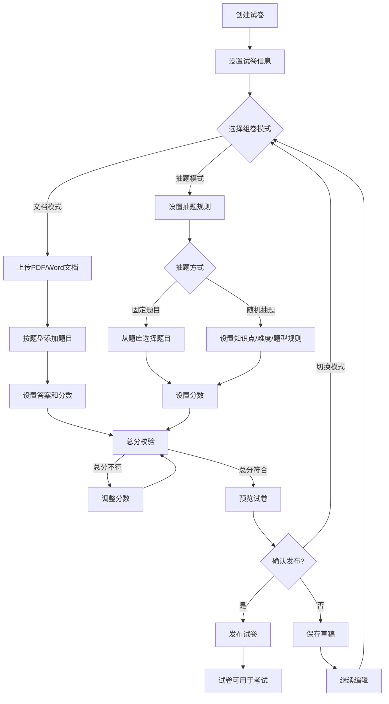
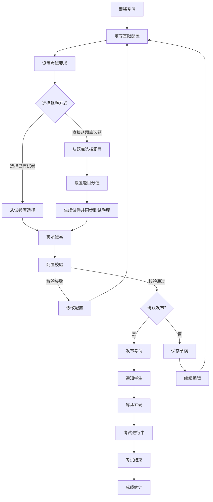
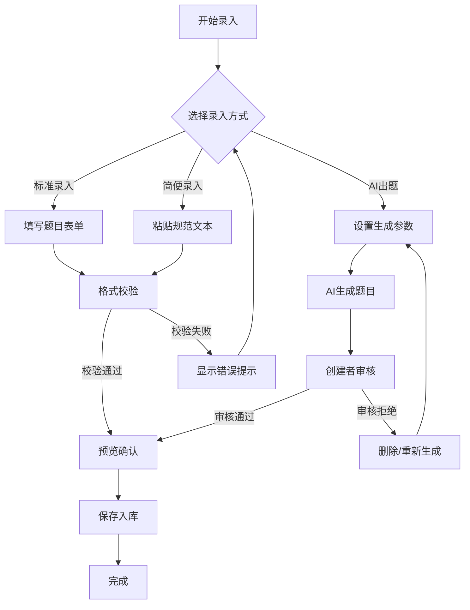
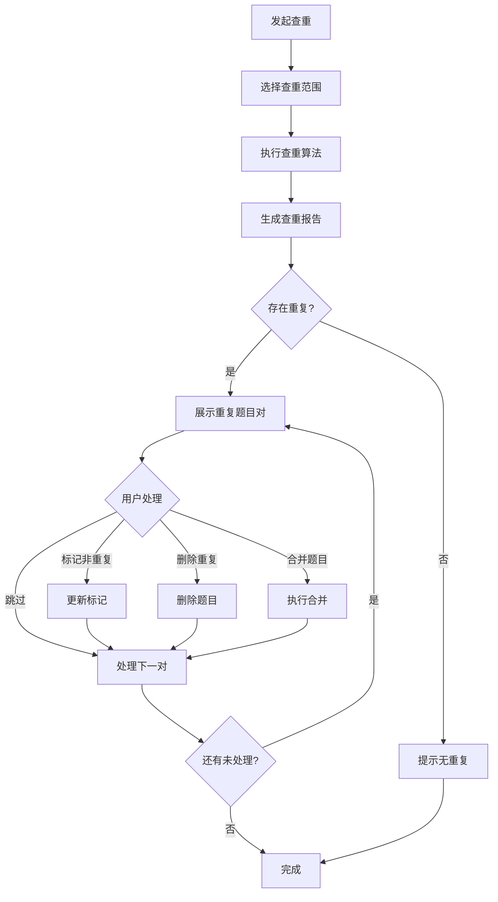
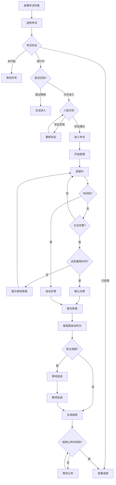

# 考试系统 - 功能清单

> 版本：v1.8
> 更新日期：2026-01-16
> 状态：需求确认中

---

## 一、需求概述

### 1.1 核心目标
构建一个功能完善的在线考试系统，覆盖"题库管理→试卷组卷→考试发布→在线作答→批阅评分→成绩统计→自主刷题"的完整业务闭环，支持多端协同（管理端、教师端、学生端），提供高效、公平、智能的考试解决方案。

### 1.2 用户画像
| 角色 | 核心诉求 |
|------|----------|
| 题库管理员 | 统一管理题目分类、维护题库质量、导出题目、AI辅助出题 |
| 组卷人员 | 灵活组卷（文档模式/抽题模式）、快速检索题目、预览试卷效果 |
| 考试管理员 | 配置考试参数、设置防作弊规则、发布考试、监控考试进度 |
| 任课教师 | 高效批阅主观题、查看成绩统计、分析学生知识点掌握情况 |
| 学生/考生 | 便捷参加考试、查看成绩和解析、自主刷题巩固、管理错题本 |

### 1.3 核心痛点
1. **出题组卷效率低**：传统逐题录入耗时耗力，需要支持简便录入和AI智能出题
2. **考试组织繁琐**：从出题到发布流程复杂，需要一站式的考试配置和发布管理
3. **考试公平性难保障**：线上考试作弊风险高，需要题目随机、人脸识别、抓拍等防作弊手段
4. **批阅工作量大**：主观题批阅耗时，需要AI辅助判分和批量评分功能
5. **学习效果难追踪**：缺乏对学生知识点掌握情况的分析，需要刷题和错题本功能辅助学习

---

## 二、题型支持

### 2.1 基础题型

| 题型 | 说明 | 数据结构要点 |
|------|------|--------------|
| 单选题 | 多个选项中选择唯一正确答案 | 选项列表（默认4个，可增加） + 正确答案索引 |
| 多选题 | 多个选项中选择多个正确答案 | 选项列表（默认4个，可增加） + 正确答案索引数组 |
| 判断题 | 判断对错 | 正确/错误 或 对/错 二选一 |
| 填空题 | 在空白处填写答案（支持有序/无序） | 空位标记 + 标准答案列表 + 同义词支持 |
| 简答题 | 文字作答 | 参考答案 + 评分要点 |

### 2.2 复合题型（大题套小题）

| 题型 | 说明 | 数据结构要点 |
|------|------|--------------|
| 阅读理解 | 材料 + 多个关联小题 | 材料内容 + 子题目数组 |
| 材料分析 | 材料 + 分析类小题 | 材料内容 + 子题目数组 |
| 综合应用 | 情境 + 多步骤问题 | 情境描述 + 子题目数组 |

**复合题型结构：**
```
复合题
├── 题目材料（文本/图片）
├── 子题目1（可为任意基础题型）
├── 子题目2
└── 子题目N
```

---

## 三、功能模块清单

### 3.1 题目录入模块

#### 3.1.1 标准录入
| 功能点 | 优先级 | 说明 |
|--------|--------|------|
| 题型选择 | P0 | 支持所有基础题型和复合题型的选择 |
| 富文本编辑 | P0 | 题干支持富文本格式（加粗、斜体、上下标、公式等） |
| 选项管理 | P0 | 动态增删选项，默认显示4个，支持选项排序 |
| 答案设置 | P0 | 根据题型设置正确答案 |
| 解析录入 | P1 | 录入题目解析说明 |
| 图片上传 | P1 | 题干、选项、解析均支持插入图片 |
| 知识点关联 | P0 | 关联题目所属知识点（支持多选） |
| 难度设置 | P1 | 设置题目难度等级 |
| 分值设置 | P0 | 设置题目默认分值 |
| 来源标注 | P2 | 标注题目来源（原创/引用/改编） |

#### 3.1.2 简便录入
| 功能点 | 优先级 | 说明 |
|--------|--------|------|
| 文本解析录入 | P0 | 按照预定义规范格式粘贴文本，系统自动解析 |
| 格式校验 | P0 | 实时校验输入格式是否符合规范 |
| 预览确认 | P0 | 解析后预览题目效果，确认后入库 |
| 批量解析 | P1 | 支持一次性粘贴多道题目文本 |
| 错误提示 | P0 | 格式错误时给出明确的错误位置和修正建议 |
| 知识点统一设置 | P1 | 所有题目知识点相同时，可统一选择知识点 |
| 检查区编辑 | P1 | 解析后在检查区可修改知识点、填空顺序等属性 |

**简便录入格式规范：**

##### 基础规则

| 规则项 | 说明 |
|--------|------|
| 题目标号 | 支持 `1.` `1、` `1:` `1。` 四种格式 |
| 答案字段 | 客观题必须含有 `答案：` 或 `答：`，主观题可不填 |
| 解析字段 | `答案解析：` 非必需，没有可不填 |
| 知识点字段 | 必填，格式为 `知识点：知识点编号`，需有编辑权限 |
| 多知识点 | 知识点编号之间用 `，` `、` `；` 隔开 |
| 选项分隔符 | 字母和选项内容用 `(` `.` `：` `。` `:` `、` 隔开 |

##### 题型特殊规则

| 题型 | 特殊规则 |
|------|----------|
| 判断题 | 选项支持：正确/错误、正确/不正确、对/错、真/假、是/否、T/F、True/False、√/× |
| 填空题 | 空位用 `____`（四个及以上下划线）或 `（）` 标识 |
| 填空题答案 | 多空答案用 `，` `、` `；` 隔开；同义词用 `|||` 连接 |
| 填空题顺序 | 默认有序填空，可在检查区修改为无序填空 |
| 复合题子题 | 格式为 `1）【题型】题干内容`，如 `1）【单选题】问题...` |

##### 输入范例

**单项选择题：**
```
1. 李白是哪个朝代的？
A. 唐
B. 宋
C. 元
D. 明
答案：A
答案解析：历史问题
知识点：yunti001
```

**多项选择题：**
```
2. 明清是中国小说史上的繁荣时期。以下作品属于明清时期四大名著的有?
A. 红楼梦
B. 三国演义
C. 窦娥冤
D. 西厢记
答案：AB
知识点：yunti001，yunti002
```

**判断题：**
```
3. 扩散现象说明物质的分子在永不停息地做无规则运动
答案：正确
```

**填空题（完形填空）：**
```
4. 某心脏患者注射肾上腺素后，心率由70次/分变为90次/分，此现象属于（） ；静脉输液时，针刺手背静脉引起缩手的动作，此现象属于（）。
A. 兴奋
B. 抑制
C. 反射
D. 刺激
E. 反应
答案：AC
```

**简答题：**
```
5. 请论述全球化对国家政治产生了哪些深刻的影响？
答案：全球化对政府的治理提出了更高的要求。
```

**复合题（阅读理解/材料分析）：**
```
6. 李翠同学正在书写一篇论文，需要在百度网上查阅资料。她在使用网络查阅资料时，碰到了以下问题。
知识点：yunti001，yunti002

1）【简答题】以IE浏览器登录百度的时候，发现登录困难。应该使用什么命令查看？
答案：ping www.baidu.com

2）【单选题】为了更好使用百度，她需要把百度设置为IE的可信站点。应该使用方法？
A. 安装360防火墙，在防火墙中设置
B. 启动"Internet选项"对话框，在"安全"选项卡中设置
C. 为计算机打补丁，封堵漏洞，然后百度就成为可信站点了
D. 在使用百度网站过程中，在弹出的快捷菜单中选择"可信站点"
答案：B
```

#### 3.1.3 AI出题
| 功能点 | 优先级 | 说明 |
|--------|--------|------|
| 知识点指定 | P0 | 指定AI出题的知识点范围 |
| 题型指定 | P0 | 指定生成的题目类型 |
| 难度指定 | P1 | 指定生成题目的难度等级 |
| 数量指定 | P0 | 指定生成题目的数量（上限50题） |
| 多模态输入 | P1 | 支持粘贴材料、上传文件（限40MB/5万字）、关联课程视频出题 |
| 生成预览 | P0 | AI生成后展示带水印预览，不直接入库 |
| 逐题编辑 | P0 | 支持对AI生成的题目进行修改 |
| 创建者审核 | P0 | 由生成题目的用户自行审核确认后入库 |
| 批量审核 | P1 | 支持批量通过或批量拒绝 |
| 一键复制 | P1 | 支持一键复制生成内容 |
| 全部录入 | P0 | 点击"全部录入"将题目批量入库 |
| 重新生成 | P1 | 对不满意的题目可要求AI重新生成 |
| 生成记录 | P2 | 记录AI出题历史 |

#### 3.1.4 题目导出
| 功能点 | 优先级 | 说明 |
|--------|--------|------|
| 按知识点导出 | P0 | 选择知识点范围导出题目 |
| Word格式导出 | P0 | 导出为 .docx 格式文档（含图片公式） |
| 导出内容配置 | P1 | 可选择答案位置：紧跟题后、文末或不导出 |
| 批量导出 | P1 | 支持多个知识点批量导出 |
| 排序设置 | P1 | 支持按知识点/题型排序 |
| 导出数量限制 | P0 | 单次导出上限 2 万题 |
| 下载链接有效期 | P1 | 下载链接保留 7 天 |

#### 3.1.5 题目纠错
| 功能点 | 优先级 | 说明 |
|--------|--------|------|
| 题目修改同步 | P0 | 修改题目后自动同步至未开始的试卷，已进行/已结束的试卷不受影响 |
| 学生纠错反馈 | P1 | 学生可对题目提交纠错反馈 |
| 纠错通知 | P1 | 有新纠错反馈时通知管理员 |
| 纠错处理 | P1 | 管理员可查看、处理纠错反馈 |

---

### 3.2 题目管理模块

#### 3.2.1 题目列表
| 功能点 | 优先级 | 说明 |
|--------|--------|------|
| 分页展示 | P0 | 题目列表分页显示 |
| 多条件筛选 | P0 | 按题型、知识点、难度、来源等筛选 |
| 关键词搜索 | P0 | 支持题干内容关键词搜索 |
| 排序功能 | P1 | 按创建时间、更新时间、使用次数等排序 |
| 批量操作 | P1 | 批量删除、批量修改分类、批量导出 |
| 快速预览 | P0 | 列表中快速预览题目详情 |

#### 3.2.2 题目详情
| 功能点 | 优先级 | 说明 |
|--------|--------|------|
| 完整展示 | P0 | 展示题目所有信息（题干、选项、答案、解析等） |
| 在线编辑 | P0 | 直接编辑题目内容 |
| 版本记录 | P2 | 记录题目修改历史 |
| 使用统计 | P2 | 显示题目被引用次数、正确率等 |

#### 3.2.3 题目删除
| 功能点 | 优先级 | 说明 |
|--------|--------|------|
| 单题删除 | P0 | 删除单道题目 |
| 批量删除 | P1 | 批量选择删除多道题目 |
| 删除确认 | P0 | 删除前二次确认 |
| 引用检查 | P1 | 检查题目是否被试卷引用，给出提示 |
| 回收站 | P1 | 删除后进入回收站，支持恢复；默认30天后自动永久删除 |

---

### 3.3 分类管理模块

#### 3.3.1 知识点管理
| 功能点 | 优先级 | 说明 |
|--------|--------|------|
| 树形结构 | P0 | 知识点支持多级树形结构 |
| 新增知识点 | P0 | 添加新的知识点节点 |
| 编辑知识点 | P0 | 修改知识点名称 |
| 删除知识点 | P0 | 删除知识点（需检查关联题目） |
| 知识点排序 | P1 | 调整同级知识点的显示顺序 |
| 知识点合并 | P2 | 合并重复或相似的知识点 |

#### 3.3.2 题型管理
| 功能点 | 优先级 | 说明 |
|--------|--------|------|
| 题型列表 | P0 | 展示系统支持的所有题型 |
| 题型启用/禁用 | P1 | 控制某些题型是否可用 |
| 自定义题型 | P1 | 基于基础题型和复合题型进行重命名，如将"复合题"改名为"完形填空" |

---

### 3.4 查重模块

#### 3.4.1 查重功能
| 功能点 | 优先级 | 说明 |
|--------|--------|------|
| 全库查重 | P0 | 对整个题库进行重复题目检测 |
| 指定范围查重 | P1 | 按知识点、题型等范围进行查重 |
| 异步任务 | P0 | 支持按"部分/全部知识点"范围建立异步查重任务 |
| 相似度阈值 | P1 | 可设置相似度判定阈值 |
| 查重报告 | P0 | 生成查重报告，列出疑似重复的题目对 |
| 对比预览 | P0 | 并排展示疑似重复的题目，方便对比 |
| 批量处理 | P1 | 批量标记为非重复 / 批量删除重复 |
| 一键智能删除 | P1 | 支持一键智能删除重复题目 |
| 合并题目 | P2 | 将重复题目合并为一道（保留最优版本） |

---

### 3.5 统计报表模块

#### 3.5.1 题库统计
| 功能点 | 优先级 | 说明 |
|--------|--------|------|
| 总量统计 | P0 | 题库总题目数量 |
| 题型分布 | P0 | 各题型题目数量及占比 |
| 知识点分布 | P0 | 各知识点题目数量及占比 |
| 难度分布 | P1 | 各难度等级题目数量及占比 |
| 来源分布 | P2 | 按来源（原创/导入/AI生成）统计 |
| 时间趋势 | P2 | 题目新增趋势图（按日/周/月） |

#### 3.5.2 使用统计
| 功能点 | 优先级 | 说明 |
|--------|--------|------|
| 引用排行 | P2 | 被引用次数最多的题目排行 |
| 正确率统计 | P2 | 题目平均正确率（需对接考试模块） |
| 未使用题目 | P2 | 从未被引用的题目列表 |

---

## 四、试卷模块

### 4.1 试卷库管理

#### 4.1.1 试卷基础管理
| 功能点 | 优先级 | 说明 |
|--------|--------|------|
| 试卷列表 | P0 | 展示所有试卷，支持分页和筛选 |
| 新增试卷 | P0 | 创建新试卷，设置基础信息 |
| 编辑试卷 | P0 | 修改试卷信息（未被使用时可修改组卷内容） |
| 预览试卷 | P0 | 预览试卷完整内容和排版效果 |
| 复制试卷 | P1 | 复制现有试卷创建新试卷 |
| 删除试卷 | P0 | 删除试卷（需检查使用状态） |

#### 4.1.2 试卷属性
| 属性 | 必填 | 说明 |
|------|------|------|
| 试卷名称 | 是 | 试卷的显示名称 |
| 试卷编号 | 是 | 试卷唯一编号 |
| 总分要求 | 是 | 试卷满分分值 |
| 组卷模式 | 是 | 文档模式 / 抽题模式 |
| 发布状态 | 是 | 草稿 / 已发布 |

#### 4.1.3 试卷状态管理
| 功能点 | 优先级 | 说明 |
|--------|--------|------|
| 发布试卷 | P0 | 组卷完成后发布，发布后才能被考试使用 |
| 模式切换 | P1 | 组卷过程中可切换文档模式/抽题模式 |
| 编辑限制 | P0 | 已被使用的试卷只能修改基础信息，不能修改组卷内容 |
| 重新组卷 | P1 | 未被使用的已发布试卷可重新组卷 |

---

### 4.2 组卷模块

#### 4.2.1 文档模式
| 功能点 | 优先级 | 说明 |
|--------|--------|------|
| 文档上传 | P0 | 支持上传 PDF、Word (.docx/.doc) 格式文档 |
| 题型添加 | P0 | 根据文档内容添加单选、多选、判断、填空、简答、复合题型 |
| 题目数量设置 | P0 | 按题型设置题目数量 |
| 选项数量设置 | P0 | 设置选择题的选项数量 |
| 答案设置 | P0 | 设置每道题的正确答案 |
| 解析设置 | P1 | 设置每道题的答案解析 |
| 分数设置 | P0 | 设置每道题的分值 |
| 批量分数修改 | P1 | 批量修改某题型所有题目的分数 |
| 单题分数修改 | P0 | 单独修改某道题的分数 |
| 总分校验 | P0 | 实时显示当前总分，小于/大于要求总分时不能提交 |

#### 4.2.2 抽题模式
| 功能点 | 优先级 | 说明 |
|--------|--------|------|
| 固定题目选择 | P0 | 从题库中选择固定题目组成试卷 |
| 随机抽题 | P0 | 按知识点、难度、题型设置抽题规则 |
| 抽题数量设置 | P0 | 设置每个规则抽取的题目数量 |
| 抽题分数设置 | P0 | 设置抽取题目的分值 |
| 个性化试卷 | P1 | 随机抽题模式下，每个学生的试卷题目不同 |
| 题目预览 | P0 | 预览抽题规则匹配的题目范围 |
| 规则冲突检测 | P1 | 检测抽题规则是否存在冲突或题目不足 |

---

### 4.3 组卷业务流程



---

## 五、考试模块

### 5.1 考试管理

#### 5.1.1 考试列表
| 功能点 | 优先级 | 说明 |
|--------|--------|------|
| 考试列表展示 | P0 | 展示所有考试，支持分页和筛选 |
| 状态筛选 | P0 | 按考试状态筛选（未开始/进行中/已结束） |
| 关键词搜索 | P0 | 支持按考试名称、编号搜索 |
| 考试详情 | P0 | 查看考试完整配置信息 |
| 编辑考试 | P0 | 修改考试配置（未开始的考试可修改） |
| 删除考试 | P0 | 删除考试（需检查状态） |
| 复制考试 | P1 | 复制现有考试创建新考试 |

#### 5.1.2 考试状态
| 状态 | 说明 | 可执行操作 |
|------|------|------------|
| 草稿 | 考试配置未完成 | 编辑、删除 |
| 待发布 | 配置完成待发布 | 编辑、发布、删除 |
| 未开始 | 已发布但未到开放时间 | 查看、取消发布 |
| 进行中 | 考试正在进行 | 查看、强制结束 |
| 已结束 | 考试已结束 | 查看、导出成绩 |

---

### 5.2 添加考试

#### 5.2.1 考试基础配置

**必填项：**
| 配置项 | 优先级 | 说明 |
|--------|--------|------|
| 考试名称 | P0 | 考试的显示名称 |
| 考试编号 | P0 | 考试唯一编号 |
| 开放时间 | P0 | 考试开始和结束时间范围 |
| 作答时长 | P0 | 学生答题限时（分钟） |
| 作答次数 | P0 | 允许学生作答的次数（1次/多次/不限） |
| 及格分数线 | P0 | 设置考试及格分数 |
| 总分 | P0 | 考试满分分值 |

**选填项（常用）：**
| 配置项 | 优先级 | 说明 |
|--------|--------|------|
| 所属课程 | P1 | 关联的课程信息 |
| 学分设置 | P1 | 考试关联学分 |
| 封面图 | P2 | 设置考试封面图片 |
| 可见性设置 | P0 | 全员可见、仅选定考生可见、仅自己可见 |
| 限制迟到时间 | P1 | 超过该时间不允许进入考试（分钟） |
| 防作弊设置 | P0 | 包含多项防作弊措施 |
| 允许提前进入 | P1 | 开考前多少分钟可进入考试 |
| 最短交卷时间 | P1 | 最少答题多长时间才能交卷（分钟） |
| 成绩公布时间 | P1 | 考试结束后何时公布成绩 |
| 成绩公布内容 | P1 | 公布分数/答案/解析的范围 |
| 拍照上传独立时间 | P1 | 主观题拍照上传的额外时间（分钟） |
| 主观题自动判分 | P1 | 是否启用AI自动批阅主观题 |
| AI评语 | P2 | 开启主观题AI评语功能 |

**终端设备设置：**
| 设置项 | 优先级 | 说明 |
|--------|--------|------|
| 仅限手机端考试 | P1 | 限制只能在手机端参加考试 |
| 锁定试卷 | P1 | 考试期间锁定试卷界面 |

**防作弊设置详情：**
| 设置项 | 优先级 | 说明 |
|--------|--------|------|
| 题目随机 | P0 | 打乱题目顺序 |
| 选项随机 | P0 | 打乱选择题选项顺序 |
| 抓拍 | P1 | 考试过程中随机抓拍（可设次数） |
| 人脸识别 | P1 | 进入考试时进行人脸识别验证 |
| 锁定试卷 | P1 | 考试期间禁止切换页面/应用 |
| 禁止复制粘贴 | P1 | 禁止复制题目内容 |

#### 5.2.2 考试组卷
| 功能点 | 优先级 | 说明 |
|--------|--------|------|
| 选择已有试卷 | P0 | 从试卷库选择已发布的试卷 |
| 直接从题库选题 | P0 | 直接从题库选择题目组成试卷 |
| 试卷同步 | P0 | 直接选题时自动同步生成试卷到试卷库 |
| 临时入库 | P1 | 流程中"添加新试卷"，生成的试卷自动入库并标记来源 |
| 试卷预览 | P0 | 预览选中试卷的完整内容 |
| 分值校验 | P0 | 校验试卷总分是否符合要求 |
| 出题中状态 | P1 | 对"出题中"试卷提供组卷入口完成闭环 |

---

### 5.3 考试发布流程



---

## 六、刷题模块

### 6.1 刷题管理

#### 6.1.1 刷题列表
| 功能点 | 优先级 | 说明 |
|--------|--------|------|
| 刷题列表展示 | P0 | 展示所有刷题任务，显示编号、名称、状态、开放时间、题目总量、参与人数；默认按创建时间倒序排列 |
| 状态筛选 | P0 | 按状态筛选（进行中/已结束） |
| 关键词搜索 | P0 | 支持按刷题名称或编号搜索 |
| 时间范围筛选 | P1 | 支持按开放时间的开始和结束日期进行区间查询 |
| 编辑刷题 | P0 | 修改刷题配置 |
| 删除刷题 | P0 | 删除刷题任务 |
| 学生管理 | P1 | 查看参与刷题的学生名单 |

---

### 6.2 添加刷题

| 功能点 | 优先级 | 说明 |
|--------|--------|------|
| 刷题名称 | P0 | 刷题任务的显示名称（限50字） |
| 刷题编号 | P0 | 自动生成的任务编号 |
| 题库选择 | P0 | 支持从已有题库中添加题目 |
| 知识点范围 | P0 | 选择刷题覆盖的知识点 |
| 题型抽取 | P0 | 根据所选知识点范围内实际存在的题型自动判断可选题型，支持自定义抽取数量 |
| 题型排序 | P1 | 支持通过上下拖拽调整不同题型在试卷中的先后顺序 |
| 难度范围 | P1 | 选择题目难度范围 |
| 题目数量 | P1 | 每次刷题的题目数量（可不限） |
| 通过标准设定 | P1 | 可开启/关闭通过阈值，设置需答对百分比（如60%）才算通过 |
| 开放时间设置 | P0 | 设置刷题任务的有效起止时间（若不设结束时间则不限时） |
| 答案显示 | P0 | 设置答案显示时机（答题后立即/全部完成后） |
| 解析显示 | P1 | 是否显示题目解析 |
| 保存草稿 | P0 | 暂存刷题配置 |
| 发布 | P0 | 正式上线刷题任务 |

---

### 6.3 刷题数据统计

#### 6.3.1 数据总览
| 功能点 | 优先级 | 说明 |
|--------|--------|------|
| 关键指标看板 | P0 | 实时显示应参加人数、实际参加人数、通过人数 |
| 核心进度统计 | P0 | 展示平均刷题进度及平均已掌握比例的百分比指标 |

#### 6.3.2 掌握情况分布
| 功能点 | 优先级 | 说明 |
|--------|--------|------|
| 可视化图表 | P1 | 提供柱状图展示不同等级（通过/不通过）的人数分布 |
| 表格模式切换 | P1 | 支持切换表格模式展示数据 |
| 等级自定义 | P1 | 支持管理员自定义通过/不通过的判定标准 |
| 智能诊断结论 | P2 | 系统根据等级设定自动生成文字描述（通过占比、需关注人数等） |
| 图表下载 | P1 | 支持下载统计图片 |
| 数据导出 | P1 | 支持导出相关数据报表 |

#### 6.3.3 学生刷题详情
| 功能点 | 优先级 | 说明 |
|--------|--------|------|
| 多维度搜索 | P1 | 支持按用户名/姓名、刷题状态（刷题中/未开始/全部掌握）过滤 |
| 时间范围筛选 | P1 | 支持数据时间范围筛选 |
| 明细列表展示 | P0 | 列出每个学生的用户名、姓名、状态、已刷题数、刷题进度、已掌握数及比例 |
| 字段排序 | P1 | 支持各字段点击排序 |
| 批量导出 | P1 | 支持勾选特定学生或选择所有数据，一键导出数据明细 |
| 查看导出任务 | P1 | 提供"查看导出任务"入口 |
| 自动刷新 | P2 | 列表支持倒计时自动刷新（如46秒后刷新），确保数据实时性 |

#### 6.3.4 题目完成统计
| 功能点 | 优先级 | 说明 |
|--------|--------|------|
| 参与人数统计 | P1 | 统计参与刷题的学生人数 |
| 题目完成统计 | P1 | 统计各题目的完成次数和正确率 |
| 知识点掌握度 | P2 | 按知识点统计学生掌握情况 |
| 学生排行榜 | P2 | 按刷题数量/正确率排行 |

---

## 七、多端功能

### 7.1 管理端功能

管理端面向题库管理员和系统管理员，提供完整的后台管理功能。

| 功能模块 | 功能点 | 优先级 |
|----------|--------|--------|
| 题库管理 | 知识点目录管理、题目管理（录入/导入/AI出题/查重/导出） | P0 |
| 试卷管理 | 试卷库管理、组卷（文档模式/抽题模式） | P0 |
| 考试管理 | 考试列表、添加考试、考试配置、考试发布 | P0 |
| 刷题管理 | 刷题列表、添加刷题、刷题统计 | P1 |
| 统计报表 | 题库统计、考试统计、使用统计 | P1 |
| 系统设置 | 用户管理、权限配置、系统参数 | P1 |

---

### 7.2 学生端功能

学生端面向考生，提供考试作答和自主学习功能。

#### 7.2.1 考试功能
| 功能点 | 优先级 | 说明 |
|--------|--------|------|
| 考试列表 | P0 | 查看可参加的考试列表 |
| 进入考试 | P0 | 人脸识别验证后进入考试 |
| 在线作答 | P0 | 支持所有题型的在线作答 |
| 答题卡 | P0 | 显示答题进度，支持快速跳转 |
| 倒计时 | P0 | 显示剩余作答时间 |
| 拍照上传 | P1 | 主观题支持拍照上传答案 |
| 交卷确认 | P0 | 交卷前确认，显示未答题目 |
| 查看批阅 | P0 | 查看已批阅的试卷和批注 |
| 查看成绩 | P0 | 查看考试成绩和排名 |
| 成绩详情 | P1 | 查看每道题的得分和解析 |

#### 7.2.2 刷题功能
| 功能点 | 优先级 | 说明 |
|--------|--------|------|
| 刷题列表 | P0 | 查看可用的刷题任务，显示开放时间、题目总量及个人进度 |
| 进度快览 | P0 | 列表页直观展示刷题进度条、掌握比例以及是否通过的标识 |
| 多维筛选 | P1 | 支持按综合排序、任务状态、个人进度以及关键词搜索任务 |
| 开始刷题 | P0 | 进入刷题模式 |
| 沉浸式答题 | P0 | 沉浸式答题界面，显示题型、当前题号及总题数 |
| 答题交互 | P0 | 支持点击选项答题、切换至下一题 |
| 收藏题目 | P1 | 答题过程中收藏重要题目 |
| 查看答题卡 | P0 | 查看答题进度和已答题目 |
| 答题反馈 | P0 | 答题后显示正确答案和解析 |
| 个人数据看板 | P1 | 任务详情页以环形图展示刷题进度和掌握比例 |
| 多维指标统计 | P1 | 记录并展示错误题数、已刷天数、今日已刷题数、今日已掌握题数 |
| 通过标准展示 | P0 | 明确展示该任务的通过标准（如：掌握比例 >= 60%） |
| 错题本 | P0 | 自动收集答错的题目 |
| 答对自动移除 | P1 | 支持"答对自动移除错题"开关控制 |
| 错题回顾/重做 | P1 | 可按刷题集查看错题分布，支持查看解析和重做错题 |
| 收藏夹 | P1 | 汇总练习过程中手动标记收藏的题目，方便重点复习 |
| 解析查看 | P0 | 错题回顾中展示正确答案、个人历史答案以及详细的答案解析 |
| 保存为图片 | P2 | 支持将错题及解析内容一键保存为图片 |
| 刷题记录 | P1 | 查看历史刷题记录和统计 |

#### 7.2.3 纠错功能
| 功能点 | 优先级 | 说明 |
|--------|--------|------|
| 提交纠错 | P1 | 对题目内容提交纠错反馈 |
| 纠错类型 | P1 | 选择纠错类型（答案错误/题干错误/选项错误等） |
| 纠错说明 | P1 | 填写详细的纠错说明 |
| 纠错记录 | P2 | 查看已提交的纠错及处理状态 |

---

### 7.3 教师端功能

教师端面向任课教师，提供批阅和统计分析功能。

#### 7.3.1 批阅功能
| 功能点 | 优先级 | 说明 |
|--------|--------|------|
| 待批阅列表 | P0 | 查看需要批阅的考试和试卷 |
| 在线批阅 | P0 | 对主观题进行在线评分 |
| 批注功能 | P1 | 在答卷上添加批注说明 |
| 评分标准 | P0 | 参考标准答案和评分要点 |
| 批量评分 | P1 | 对相同答案批量给分 |
| 批阅进度 | P0 | 显示批阅完成进度 |
| AI辅助批阅 | P2 | AI预判分，教师确认或调整 |

#### 7.3.2 统计功能
| 功能点 | 优先级 | 说明 |
|--------|--------|------|
| 成绩统计 | P0 | 查看考试成绩分布和统计数据 |
| 成绩导出 | P0 | 导出成绩为Excel格式 |
| 题目分析 | P1 | 分析每道题的正确率和区分度 |
| 知识点分析 | P1 | 按知识点分析学生掌握情况 |
| 学生排名 | P1 | 查看学生成绩排名 |
| 对比分析 | P2 | 多次考试成绩对比分析 |

---

## 八、数据模型概要

### 8.1 核心实体

```
题目 (Question)
├── 基础信息
│   ├── ID (唯一标识)
│   ├── 题型 (question_type)
│   ├── 题干 (content)
│   ├── 选项 (options) [选择题]
│   ├── 答案 (answer)
│   ├── 解析 (explanation)
│   ├── 分值 (score)
│   └── 难度 (difficulty)
├── 分类信息
│   ├── 知识点 (knowledge_points) [多对多]
│   └── 来源 (source)
├── 复合题关联
│   ├── 父题目ID (parent_id) [子题目]
│   ├── 材料内容 (material) [父题目]
│   └── 子题目顺序 (child_order)
├── 媒体资源
│   └── 图片列表 (images)
└── 元数据
    ├── 创建时间 (created_at)
    ├── 更新时间 (updated_at)
    ├── 创建人 (created_by)
    └── 状态 (status)

知识点 (KnowledgePoint)
├── ID
├── 名称 (name)
├── 父知识点ID (parent_id)
├── 层级 (level)
└── 排序 (sort_order)

试卷 (Paper)
├── 基础信息
│   ├── ID (唯一标识)
│   ├── 试卷名称 (name)
│   ├── 试卷编号 (code)
│   ├── 总分 (total_score)
│   └── 组卷模式 (mode: document/extraction)
├── 状态信息
│   ├── 发布状态 (status: draft/published)
│   ├── 使用状态 (is_used)
│   └── 使用次数 (usage_count)
├── 组卷内容
│   ├── 文档内容 (document_content) [文档模式]
│   └── 抽题规则 (extraction_rules) [抽题模式]
└── 元数据
    ├── 创建时间 (created_at)
    ├── 更新时间 (updated_at)
    └── 创建人 (created_by)

试卷题目关联 (PaperQuestion)
├── 试卷ID (paper_id)
├── 题目ID (question_id)
├── 题目顺序 (order)
├── 分值 (score)
└── 是否打乱 (is_shuffled)

抽题规则 (ExtractionRule)
├── ID
├── 试卷ID (paper_id)
├── 知识点范围 (knowledge_point_ids)
├── 难度范围 (difficulty_range)
├── 题型 (question_type)
├── 抽取数量 (count)
└── 每题分值 (score_per_question)

考试 (Exam)
├── 基础信息
│   ├── ID (唯一标识)
│   ├── 考试名称 (name)
│   ├── 考试编号 (code)
│   ├── 所属课程 (course_id)
│   └── 试卷ID (paper_id)
├── 时间配置
│   ├── 开放开始时间 (start_time)
│   ├── 开放结束时间 (end_time)
│   ├── 作答时长 (duration)
│   ├── 限制迟到时间 (late_limit)
│   ├── 允许提前进入 (early_entry)
│   └── 最短交卷时间 (min_submit_time)
├── 作答配置
│   ├── 作答次数 (attempt_limit)
│   ├── 拍照上传时间 (photo_upload_time)
│   └── 主观题自动判分 (auto_grading)
├── 防作弊配置
│   ├── 题目随机 (shuffle_questions)
│   ├── 选项随机 (shuffle_options)
│   ├── 抓拍 (capture_enabled)
│   ├── 人脸识别 (face_recognition)
│   ├── 锁定试卷 (lock_paper)
│   └── 禁止复制 (disable_copy)
├── 成绩配置
│   ├── 成绩公布时间 (score_publish_time)
│   └── 成绩公布内容 (score_publish_content)
├── 状态信息
│   ├── 状态 (status: draft/pending/not_started/in_progress/ended)
│   └── 参与人数 (participant_count)
└── 元数据
    ├── 创建时间 (created_at)
    ├── 更新时间 (updated_at)
    └── 创建人 (created_by)

考试记录 (ExamRecord)
├── ID
├── 考试ID (exam_id)
├── 学生ID (student_id)
├── 试卷快照ID (paper_snapshot_id)
├── 开始时间 (start_time)
├── 提交时间 (submit_time)
├── 答题数据 (answers)
├── 客观题得分 (objective_score)
├── 主观题得分 (subjective_score)
├── 总分 (total_score)
├── 批阅状态 (grading_status)
├── 批阅人 (grader_id)
└── 批阅时间 (graded_at)

刷题任务 (PracticeTask)
├── ID
├── 任务名称 (name)
├── 知识点范围 (knowledge_point_ids)
├── 题型范围 (question_types)
├── 难度范围 (difficulty_range)
├── 题目数量 (question_count)
├── 答案显示时机 (answer_display)
├── 解析显示 (show_explanation)
├── 状态 (status: enabled/disabled)
├── 创建时间 (created_at)
└── 创建人 (created_by)

刷题记录 (PracticeRecord)
├── ID
├── 任务ID (task_id)
├── 学生ID (student_id)
├── 题目ID (question_id)
├── 学生答案 (answer)
├── 是否正确 (is_correct)
├── 答题时间 (answered_at)
└── 是否加入错题本 (in_wrong_book)

错题本 (WrongBook)
├── ID
├── 学生ID (student_id)
├── 题目ID (question_id)
├── 来源类型 (source_type: exam/practice)
├── 来源ID (source_id)
├── 错误次数 (wrong_count)
├── 最后错误时间 (last_wrong_at)
└── 是否已掌握 (is_mastered)
```

---

## 九、业务流程

### 9.1 题目录入流程



### 9.2 查重处理流程



### 9.3 学生考试流程



---

## 十、优先级说明

| 优先级 | 说明 | 建议阶段 |
|--------|------|----------|
| P0 | 核心功能，必须实现 | MVP阶段 |
| P1 | 重要功能，提升体验 | 第二迭代 |
| P2 | 增强功能，锦上添花 | 后续迭代 |

---

## 十一、权限模型

### 11.1 组织架构

系统采用**多租户模式**，每个租户（组织/学校）数据完全隔离。

```
平台
├── 租户A（学校A）
│   ├── 组织单元1（院系1）
│   │   ├── 用户组1（班级1）
│   │   └── 用户组2（班级2）
│   └── 组织单元2（院系2）
├── 租户B（学校B）
└── ...
```

### 11.2 角色定义

| 角色 | 作用域 | 说明 |
|------|--------|------|
| 平台管理员 | 平台级 | 管理所有租户，系统配置 |
| 租户管理员 | 租户级 | 管理本租户的用户、角色、系统设置 |
| 题库管理员 | 租户级 | 管理题库、知识点分类、题目审核 |
| 组卷人员 | 租户级 | 创建和管理试卷 |
| 考试管理员 | 租户级 | 创建和管理考试、监控考试进度 |
| 教师 | 组织单元级 | 批阅试卷、查看成绩统计 |
| 学生 | 用户组级 | 参加考试、刷题练习 |

**说明：** 一个用户可同时拥有多个角色（如：某教师同时是题库管理员和考试管理员）。

### 11.3 权限点清单

#### 11.3.1 题库权限

| 权限点 | 权限码 | 说明 |
|--------|--------|------|
| 查看题目列表 | `question:list` | 查看题库中的题目 |
| 查看题目详情 | `question:view` | 查看题目完整内容 |
| 创建题目 | `question:create` | 通过任意方式录入题目 |
| 编辑题目 | `question:edit` | 修改题目内容 |
| 删除题目 | `question:delete` | 删除题目 |
| 导出题目 | `question:export` | 导出题目 |
| AI出题 | `question:ai_generate` | 使用AI生成题目 |
| 题目查重 | `question:duplicate_check` | 执行查重操作 |
| 管理知识点 | `knowledge:manage` | 增删改知识点分类 |

#### 11.3.2 试卷权限

| 权限点 | 权限码 | 说明 |
|--------|--------|------|
| 查看试卷列表 | `paper:list` | 查看试卷库 |
| 查看试卷详情 | `paper:view` | 查看试卷完整内容 |
| 创建试卷 | `paper:create` | 创建新试卷 |
| 编辑试卷 | `paper:edit` | 修改试卷内容 |
| 删除试卷 | `paper:delete` | 删除试卷 |
| 发布试卷 | `paper:publish` | 发布试卷供考试使用 |

#### 11.3.3 考试权限

| 权限点 | 权限码 | 说明 |
|--------|--------|------|
| 查看考试列表 | `exam:list` | 查看考试列表 |
| 查看考试详情 | `exam:view` | 查看考试配置 |
| 创建考试 | `exam:create` | 创建新考试 |
| 编辑考试 | `exam:edit` | 修改考试配置 |
| 删除考试 | `exam:delete` | 删除考试 |
| 发布考试 | `exam:publish` | 发布考试 |
| 监控考试 | `exam:monitor` | 实时监控考试进度 |
| 强制结束考试 | `exam:force_end` | 强制结束进行中的考试 |

#### 11.3.4 批阅权限

| 权限点 | 权限码 | 说明 |
|--------|--------|------|
| 查看待批阅列表 | `grading:list` | 查看需要批阅的试卷 |
| 批阅试卷 | `grading:grade` | 对主观题评分 |
| 修改评分 | `grading:modify` | 修改已批阅的分数 |
| 查看成绩 | `score:view` | 查看考试成绩 |
| 导出成绩 | `score:export` | 导出成绩数据 |

#### 11.3.5 刷题权限

| 权限点 | 权限码 | 说明 |
|--------|--------|------|
| 查看刷题列表 | `practice:list` | 查看刷题任务 |
| 创建刷题任务 | `practice:create` | 创建刷题任务 |
| 编辑刷题任务 | `practice:edit` | 修改刷题任务 |
| 删除刷题任务 | `practice:delete` | 删除刷题任务 |
| 参与刷题 | `practice:participate` | 学生参与刷题 |

#### 11.3.6 系统权限

| 权限点 | 权限码 | 说明 |
|--------|--------|------|
| 用户管理 | `user:manage` | 增删改用户 |
| 角色管理 | `role:manage` | 管理角色和权限分配 |
| 系统设置 | `system:settings` | 修改系统配置 |
| 查看日志 | `log:view` | 查看操作日志 |
| 统计报表 | `report:view` | 查看统计报表 |

### 11.4 默认角色权限映射

| 角色 | 默认权限 |
|------|----------|
| 平台管理员 | 所有权限 |
| 租户管理员 | `user:manage`, `role:manage`, `system:settings`, `log:view`, `report:view` |
| 题库管理员 | `question:*`, `knowledge:manage`, `report:view` |
| 组卷人员 | `question:list`, `question:view`, `paper:*` |
| 考试管理员 | `paper:list`, `paper:view`, `exam:*`, `practice:*`, `score:view`, `score:export` |
| 教师 | `grading:*`, `score:view`, `score:export`, `report:view` |
| 学生 | `exam:list`(仅可见分配的考试), `practice:participate` |

### 11.5 数据权限规则

| 规则 | 说明 |
|------|------|
| 租户隔离 | 不同租户数据完全隔离，互不可见 |
| 创建者优先 | 用户默认可管理自己创建的资源 |
| 组织单元范围 | 教师只能批阅本组织单元学生的试卷 |
| 考试可见性 | 学生只能看到分配给自己所在用户组的考试 |
| 题库共享 | 同一租户内题库默认共享，可设置知识点访问权限 |

---

## 十二、交互细节与边界情况

### 12.1 通用交互规范

#### 12.1.1 加载状态

| 场景 | 处理方式 |
|------|----------|
| 列表加载 | 显示骨架屏（Skeleton），保持布局稳定 |
| 表单提交 | 按钮显示 loading 状态，禁止重复点击 |
| 文件上传 | 显示上传进度条，支持取消上传 |
| 长时间操作 | 显示进度百分比或预估剩余时间 |

#### 12.1.2 空状态

| 场景 | 显示内容 |
|------|----------|
| 列表无数据 | 友好的空状态插图 + 引导文案 + 操作按钮 |
| 搜索无结果 | "未找到匹配结果" + 建议调整搜索条件 |
| 筛选无结果 | "当前筛选条件下无数据" + 清除筛选按钮 |
| 权限不足 | "暂无权限访问" + 联系管理员提示 |

#### 12.1.3 错误处理

| 错误类型 | 处理方式 |
|----------|----------|
| 网络错误 | Toast 提示 "网络连接失败，请检查网络" + 重试按钮 |
| 服务器错误 | Toast 提示 "服务器繁忙，请稍后重试" |
| 权限错误 | 跳转到无权限页面或 Toast 提示 |
| 表单校验错误 | 字段下方显示红色错误提示，聚焦到第一个错误字段 |
| 业务逻辑错误 | Modal 弹窗显示详细错误信息和解决建议 |

#### 12.1.4 确认操作

| 操作类型 | 确认方式 |
|----------|----------|
| 删除操作 | 二次确认弹窗，显示影响范围 |
| 批量操作 | 显示操作数量，二次确认 |
| 不可逆操作 | 输入确认文字（如输入"删除"）后才能执行 |
| 发布操作 | 预览 + 确认弹窗 |

### 12.2 题库模块边界情况

#### 12.2.1 题目录入

| 边界情况 | 处理方式 |
|----------|----------|
| 题干为空 | 表单校验不通过，提示"请输入题干内容" |
| 选择题选项不足 | 至少需要2个选项，否则提示"选项数量不足" |
| 未设置正确答案 | 客观题必须设置答案，否则提示"请设置正确答案" |
| 未关联知识点 | 提示"请选择至少一个知识点" |
| 图片上传失败 | 显示上传失败提示，支持重新上传 |
| 简便录入格式错误 | 高亮错误行，显示具体错误原因和修正建议 |

#### 12.2.2 题目删除

| 边界情况 | 处理方式 |
|----------|----------|
| 题目被试卷引用 | 提示"该题目已被 N 份试卷引用"，列出试卷名称 |
| 题目被进行中考试使用 | 禁止删除，提示"该题目正在考试中使用" |
| 复合题删除 | 删除父题目时同时删除所有子题目，需二次确认 |

### 12.3 试卷模块边界情况

#### 12.3.1 组卷

| 边界情况 | 处理方式 |
|----------|----------|
| 总分不符合要求 | 实时显示当前总分，不符合时禁止提交并高亮提示 |
| 抽题规则题目不足 | 提示"符合条件的题目仅 N 道，少于要求的 M 道" |
| 抽题规则冲突 | 检测并提示规则冲突，如同一题目被多个规则匹配 |
| 文档上传失败 | 提示上传失败原因，支持重新上传 |
| 文档格式异常 | 提示"文档格式解析失败，请检查文档格式" |

#### 12.3.2 试卷状态变更

| 边界情况 | 处理方式 |
|----------|----------|
| 已发布试卷修改 | 仅允许修改基础信息，组卷内容锁定 |
| 已被考试使用的试卷 | 禁止删除，提示"该试卷已被 N 场考试使用" |
| 取消发布 | 检查是否有未开始的考试引用，有则提示 |

### 12.4 考试模块边界情况

#### 12.4.1 考试配置

| 边界情况 | 处理方式 |
|----------|----------|
| 开放时间早于当前时间 | 提示"开放时间不能早于当前时间" |
| 结束时间早于开始时间 | 提示"结束时间必须晚于开始时间" |
| 作答时长超过开放时长 | 警告提示，但允许保存 |
| 未选择试卷 | 提示"请选择考试试卷" |
| 试卷总分与配置不符 | 显示试卷实际总分，提示确认 |

#### 12.4.2 考试进行中

| 边界情况 | 处理方式 |
|----------|----------|
| 学生迟到超过限制 | 显示"您已超过允许的迟到时间，无法进入考试" |
| 人脸识别失败 | 允许重试3次，超过后需联系监考老师 |
| 考试中网络断开 | 本地缓存答案，网络恢复后自动同步 |
| 考试中页面刷新 | 恢复到断点继续答题，时间继续计算 |
| 考试中切换页面 | 根据防作弊设置，记录或警告或强制交卷 |
| 时间到未交卷 | 自动提交当前答案 |
| 提前交卷未达最短时间 | 提示"答题时间未满 N 分钟，请继续作答" |

#### 12.4.3 考试结束后

| 边界情况 | 处理方式 |
|----------|----------|
| 成绩未公布 | 显示"成绩将于 XX 时间公布" |
| 部分试卷未批阅 | 显示"成绩待批阅完成后公布" |
| 申请查分 | 提供查分申请入口（如需要） |

### 12.5 刷题模块边界情况

| 边界情况 | 处理方式 |
|----------|----------|
| 刷题任务无可用题目 | 提示"当前知识点下暂无题目" |
| 所有题目已刷完 | 提示"恭喜！您已完成所有题目"，提供重新开始选项 |
| 刷题中退出 | 自动保存进度，下次继续 |
| 错题本为空 | 显示"暂无错题，继续保持！" |

### 12.6 并发与冲突处理

| 场景 | 处理方式 |
|------|----------|
| 同时编辑同一题目 | 乐观锁机制，后保存者提示"内容已被他人修改"，提供合并或覆盖选项 |
| 同时编辑同一试卷 | 同上 |
| 批量操作部分失败 | 显示成功/失败数量，提供失败项详情 |
| 高并发考试提交 | 队列处理，确保数据一致性 |

### 12.7 性能边界

| 场景 | 建议限制 |
|------|----------|
| 单份试卷题目数 | ≤ 200 道 |
| 单场考试人数 | ≤ 10000 人 |
| 题库搜索结果 | 分页显示，每页 ≤ 50 条 |
| 文件上传大小 | ≤ 50MB |

---

## 十三、待确认事项

| 事项 | 状态 | 确认结果 |
|------|------|----------|
| 难度等级定义 | ✅ 已确认 | 一、二、三、四、五（5级） |
| 知识点体系 | ✅ 已确认 | 按目录层级创建，无固定要求 |
| 知识点权限控制 | ✅ 已确认 | 不需要 |
| 组织架构模式 | ✅ 已确认 | 多租户模式，数据完全隔离 |
| 权限控制粒度 | ✅ 已确认 | 基于权限点的细粒度控制 |
| 多角色支持 | ✅ 已确认 | 允许用户拥有多个角色 |
| AI出题对接 | ⏳ 待定 | 暂定，后续确认接口规范 |
| 图片存储方案 | ⏳ 待定 | 需确认存储和访问方案 |

---

## 十四、附录

### 14.1 术语表

| 术语 | 说明 |
|------|------|
| 复合题 | 包含材料和多个子题目的题型，如阅读理解 |
| 知识点 | 题目所考查的知识内容分类 |
| 查重 | 检测题库中相似或重复的题目 |
| 简便录入 | 通过粘贴规范格式文本快速录入题目 |
| 文档模式 | 上传 PDF/Word 文档进行组卷的方式 |
| 抽题模式 | 从题库中选择或随机抽取题目组卷的方式 |
| 固定题目 | 组卷时指定的固定题目，所有学生看到相同题目 |
| 随机抽题 | 按规则从题库随机抽取题目，每个学生试卷可能不同 |
| 防作弊设置 | 考试中防止作弊的技术手段，如题目随机、人脸识别等 |
| 错题本 | 自动收集学生答错题目的功能模块 |
| 刷题 | 学生自主练习题目的学习模式 |
| 批阅 | 教师对主观题进行评分和批注的过程 |
| 管理端 | 面向管理员的后台管理系统 |
| 学生端 | 面向学生的考试和学习系统 |
| 教师端 | 面向教师的批阅和统计系统 |

### 14.2 修订记录

| 版本 | 日期 | 修订内容 | 修订人 |
|------|------|----------|--------|
| v1.0 | 2026-01-14 | 初稿，题库模块功能清单 | - |
| v1.1 | 2026-01-15 | 新增试卷模块；新增题目导出、题目纠错功能 | - |
| v1.2 | 2026-01-15 | 新增考试模块、刷题模块；新增多端功能划分（管理端/学生端/教师端）；完善数据模型和业务流程 | - |
| v1.3 | 2026-01-16 | 新增权限模型（多租户、角色、权限点）；新增交互细节与边界情况规范 | - |
| v1.4 | 2026-01-16 | 整合 Excel 功能清单：补充AI出题多模态输入、题目导出限制、查重异步任务、试卷来源标签、考试可见性/切屏限制/AI评语、刷题数据统计（看板/图表/详情）、学生端刷题增强（沉浸式答题/数据看板/错题管理） | - |
| v1.5 | 2026-01-16 | 题库功能优化：基础题型精简为5种（单选/多选/判断/填空/简答）；删除Word批量导入功能；选项默认4个可增加；回收站30天自动删除；自定义题型改为重命名功能 | - |
| v1.6 | 2026-01-16 | 试卷模块优化：删除来源标签功能；删除试卷纠错入口（保留题库和学生端纠错）；抽题模式简化为固定和随机两种；删除难度分布设定 | - |
| v1.7 | 2026-01-16 | 考试模块优化：防作弊设置中删除静态活体检测和切屏限制功能 | - |
| v1.8 | 2026-01-16 | 刷题模块优化：删除置顶/排序功能（默认按创建时间倒序）；删除启用/禁用功能；题型抽取改为根据知识点范围内实际题型自动判断 | - |
